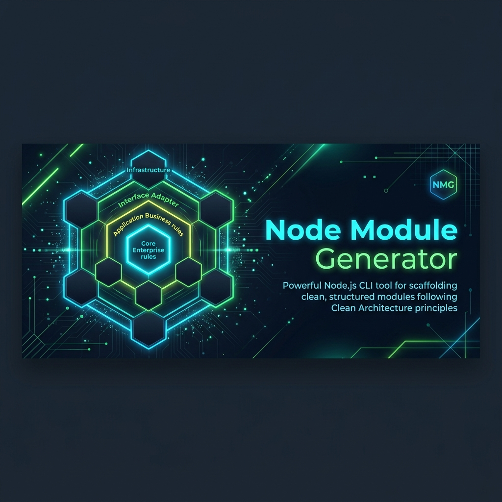
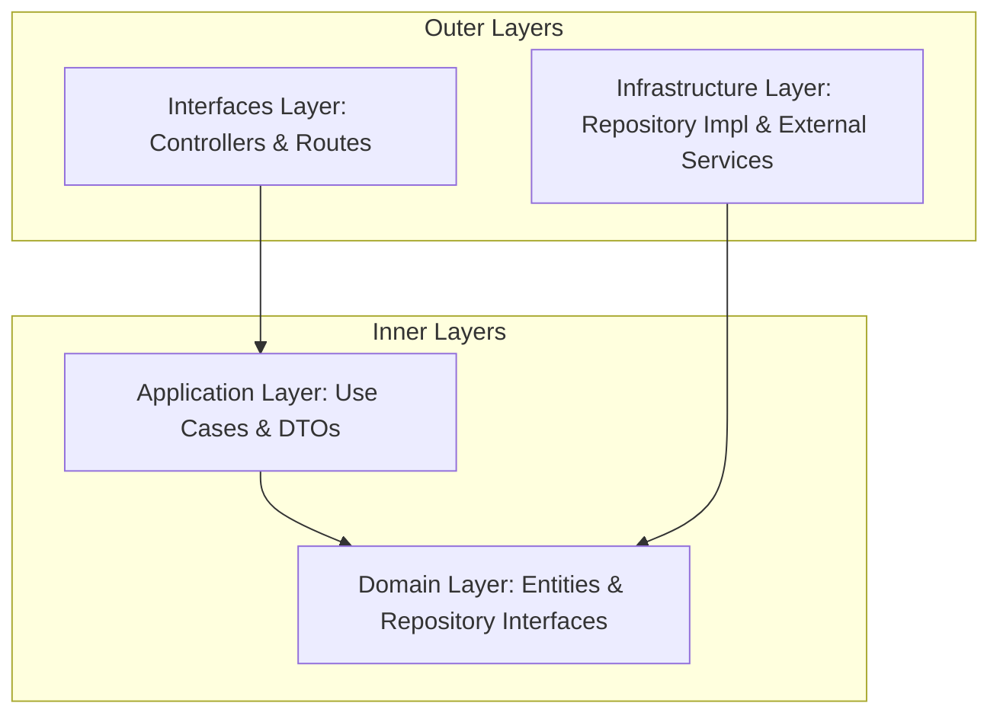

<div align="center">
  
  <h1>🚀 Node Module Generator (NMG)</h1>
  <p><strong>The ultimate CLI companion for rapid, enterprise-grade Node.js scaffolding.</strong></p>
  <p>
    <a href="https://github.com/saul-paulus/node-module-generator/actions/workflows/ci.yml">
      
    </a>
    <a href="https://www.npmjs.com/package/@saulpaulus17/node-module-generator">
      
    </a>
    <a href="https://www.npmjs.com/package/@saulpaulus17/node-module-generator">
      
    </a>
    <a href="https://github.com/saul-paulus/node-module-generator/blob/main/LICENSE">
      
    </a>
  </p>
</div>

---

## 🏛️ Architecture Overview

Node Module Generator (NMG) enforces **Clean Architecture** principles to ensure your backend remains scalable, testable, and decoupled. It is purpose-built for high-performance **Express.js** environments using **Awilix** for Dependency Injection.

### Layered Structure


---

## 🔥 Key Features

- 💎 **Clean Architecture by Design**: Strict separation into Domain, Application, Infrastructure, and Interface layers.
- 💉 **Native Dependency Injection**: Fully pre-configured for **Awilix**, providing seamless DI management.
- 🧪 **Test-Ready Scaffolding**: Automatically generates **Jest** test suites for Controllers and Use Cases.
- 🚀 **Modern Tooling**: Native support for **ES Modules (ESM)**, **Prisma ORM**, and **Joi/Zod** DTO patterns.
- 🤖 **Granular Control**: Generate full modules or individual components (UseCases, Repos, DTOs) without disrupting existing code.

---

## 📦 Installation

### Prerequisites
- **Node.js**: v18.0.0 or higher (LTS recommended)
- **NPM**, **Yarn**, or **PNPM**

### Global Installation (Recommended)
Install NMG globally to access the command from any project.

```bash
npm install -g @saulpaulus17/node-module-generator
```

### Direct Execution
Run it on-the-fly without a permanent installation:

```bash
npx @saulpaulus17/node-module-generator <command> <name>
```

---

## 🛠️ Target Project Dependencies

To ensure the modules generated by NMG function correctly, your main project must have the following core dependencies installed:

### Production Dependencies
```bash
npm install express awilix @prisma/client
```

### Development Dependencies
```bash
npm install --save-dev jest
```

> [!TIP]
> These dependencies are essential because the generated code relies on Express for routing, Awilix for Dependency Injection, and Prisma for the data layer.

---

## 🚀 Detailed Usage

### 1. Generating a Full Module
Scaffolds a complete standard architecture with all 4 layers and initial unit tests.

```bash
nmg module Auth
```

### 2. Generating Individual Components
Quickly add specific components to an existing module structure.

```bash
# Add a new UseCase (e.g., login) to the Auth module
nmg usecase login --module=Auth

# Add a Repository Interface and Implementation (Prisma)
nmg repository User

# Add a DTO validation schema
nmg dto userRegistration --module=Auth
```

---

## 📂 Project Blueprint

Scaffolding a module (e.g., `nmg module Product`) produces the following industry-standard structure:

```text
src/modules/Product/
├── application/                 
│   ├── dtos/                    # DTO schemas (e.g., product.dto.js)
│   └── usecases/                # Business orchestration
│       ├── ProductUseCase.js    # Logic implementation
│       └── ProductUseCase.test.js # Unit tests
├── domain/                      
│   ├── entities/                # Business entity definitions
│   │   └── Product.js
│   └── repositories/            # Repository Interface (Contracts)
│       └── ProductRepository.js
├── infrastructure/              
│   ├── repositories/            # Implementation (default: Prisma)
│   │   └── PrismaProductRepository.js
├── interfaces/                  
│   ├── controllers/             # Express handlers
│   │   ├── ProductController.js
│   │   └── ProductController.test.js
│   └── routes/                  # Express routes & method binding
│       └── product.routes.js
└── Product.module.js            # Central Awilix Module Registration
```

---

## 🛠️ Post-Scaffolding Integration

To finalize your new module integration, follow these standard steps:

1.  **DI Registration**: Open `src/container.js` and register any specific repository aliases or scoped usecases.
2.  **Route Mounting**: Mount the generated router in `src/app.js`:
    ```javascript
    app.use('/api/v1/product', container.resolve('productRoutes'));
    ```
3.  **Detailed Implementation**: Build out the specific logic in the generated templates (which are already integrated via Awilix).

---

## 🤝 Contributing & Support

We welcome contributions from the community!
1. Fork the project.
2. Create your Feature Branch (`git checkout -b feat/NewFeature`).
3. Commit your changes (`git commit -m 'feat: Add some NewFeature'`).
4. Push to the Branch (`git push origin feat/NewFeature`).
5. Open a Pull Request.

---

## 📝 License

Distributed under the **MIT License**. See `LICENSE` for more information.

---
<div align="center">
  <p>Built with ❤️ for modern Node.js developers</p>
  <sub>Copyright © 2024 saul-paulus</sub>
</div>
